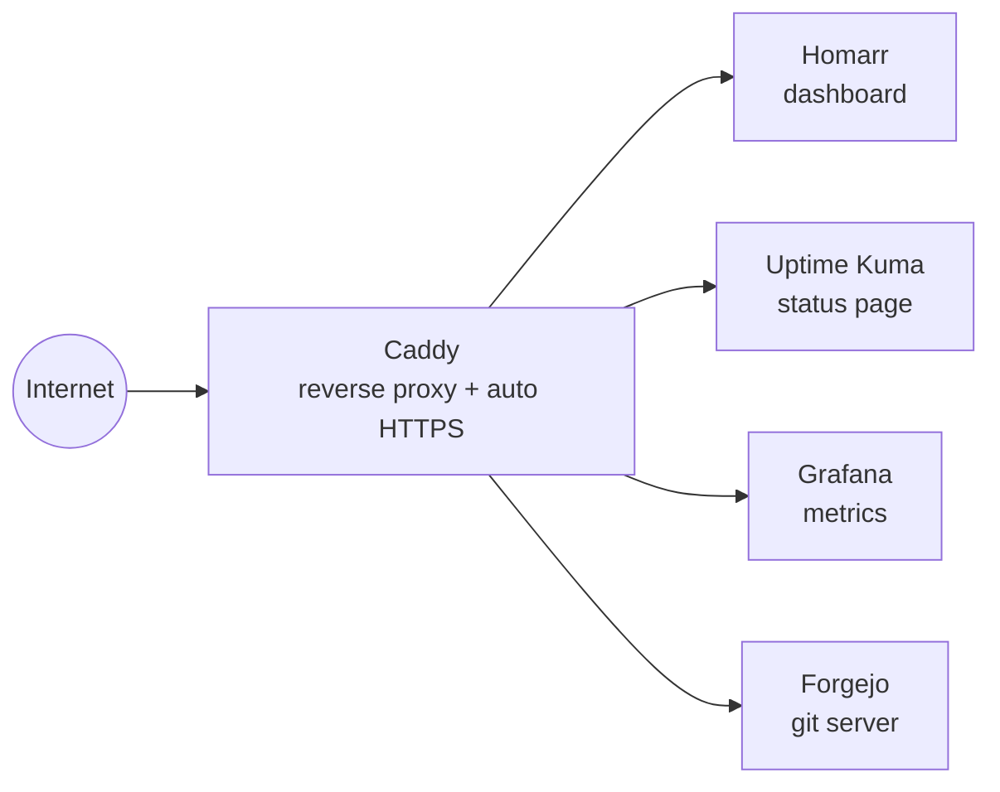

# Cloudlab

The Docker Compose stack running my personal VPS ("Bastion") — a dashboard, uptime monitoring, metrics, and a self-hosted git server, all behind one reverse proxy with automatic HTTPS. This is the actual config running in production on the box, not a tutorial or a demo.

## Architecture



Caddy terminates TLS for every subdomain and reverse-proxies to the right container by name — no manual certificate handling, no exposed ports beyond 80/443 (and 222 for git-over-SSH).

## Services

| Service | What it does | Reached at |
|---|---|---|
| Caddy | Reverse proxy, automatic HTTPS via Let's Encrypt | — |
| Homarr | Home dashboard for the server | `home.*` |
| Uptime Kuma | Uptime monitoring, public status page | `status.*` |
| Grafana | Metrics dashboards | `grafana.*` |
| Forgejo | Self-hosted git (lightweight Gitea fork) | `git.*` |

## Running it

Requires Docker + Docker Compose.

```bash
cp .env.example .env
# generate a real encryption key and put it in .env:
openssl rand -hex 32
```

```bash
docker compose up -d
```

## Notes

- Runs on a small Hetzner VPS — the point is that this doesn't need to be big to be reliable.
- Secrets are kept out of git entirely. `.env.example` shows what's needed; real values live in a local, gitignored `.env`.
- No named volumes are bind-mounted to source-controlled paths except where explicitly needed — container data (databases, caches) stays out of this repo.
